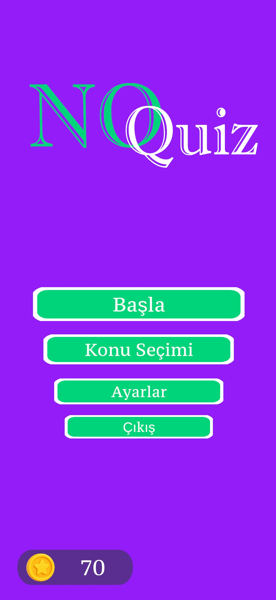
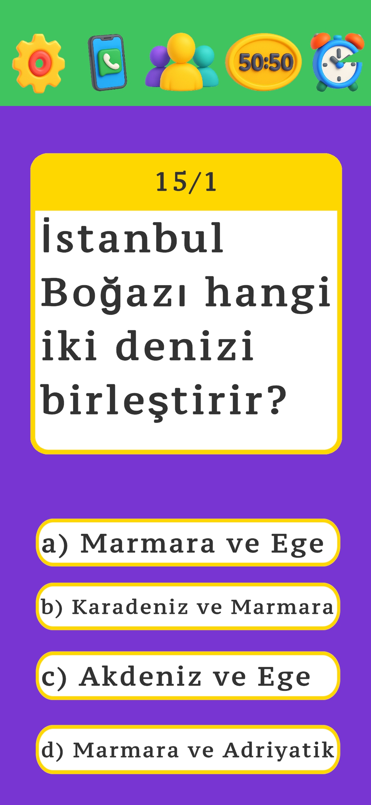
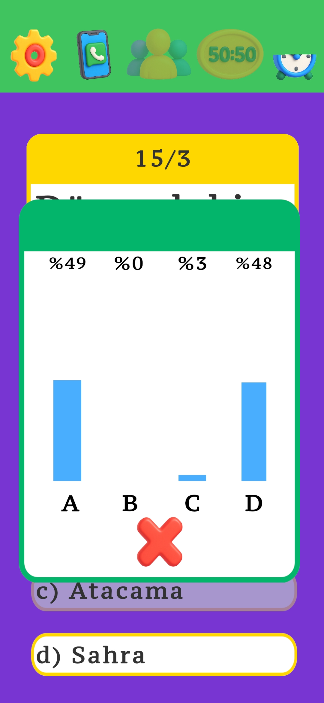
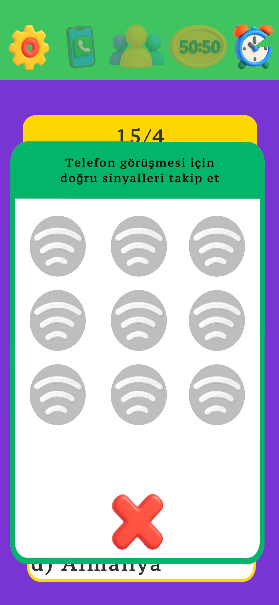

# 🎮 Unity Projects by Osman Demirhan

Bu repo, Unity oyun motoru ile geliştirdiğim projeleri içermektedir. Her oyun farklı bir oyun mekaniği ve deneyim sunmayı amaçlamaktadır. Oyunların her biri kendi klasöründe yer almakta ve açıklayıcı görseller ile desteklenmiştir.

---

## 📂 Projeler

### 🧭 Oryantiring Oyunu

Gerçek hayattaki oryantiring sporunu dijital ortama taşıyan bir eğitim oyunu. Oyuncular harita üzerinde belirlenen hedefleri süreye karşı bulmaya çalışır.  
📁 [Proje klasörü](./oryantiring)

**Teknolojiler:** Unity, C#, 2D Sprite, UI

📸 Örnek Görsel:

---

### ❓ Quiz Game

Klasik bir bilgi yarışması oyunu. Sorular rastgele gelir ve her doğru cevap oyuncuya puan kazandırır. Basit, eğlenceli ve kullanıcı dostu bir deneyim sunar.  
📁 [Proje klasörü](./QuizGame)

**Teknolojiler:** Unity, C#, UI Canvas

📸 Proje Görselleri:

  
  
  
  
  

## ✨ Notlar
- Oyunları Unity Editor ile çalıştırarak deneyimleyebilirsiniz.

---

## 👤 Geliştirici

**Osman Demirhan**  
📧 osman61demirhan@gmail.com  
📍 Bursa / Türkiye  
🎓 Isparta Uygulamalı Bilimler Üniversitesi – Bilgisayar Mühendisliği
